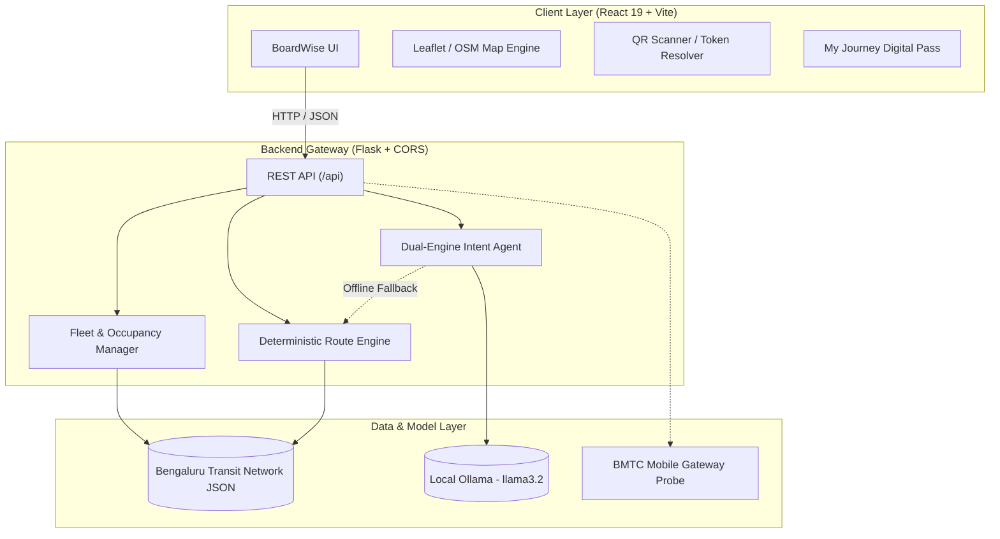
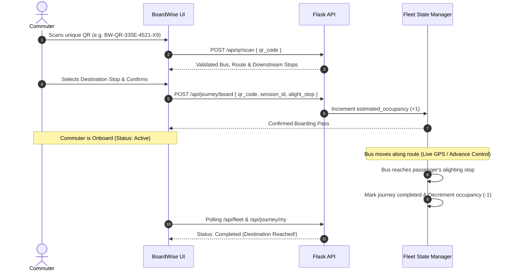

# 🧭 BoardWise AI

<div align="center">


**An intelligent open-source urban transit agent and fleet occupancy estimation engine for Bengaluru commuters.**  
*Your journey, thought through. Plan a feasible trip. Find alternatives when things change.*

[Live Demo](#-live-deployment) • [Architecture](#-architecture) • [Features](#-key-features) • [Quickstart](#-quick-start) • [API Docs](#-api-endpoints)

</div>

---

## 📌 Executive Summary

**BoardWise AI** solves three pervasive urban transit problems in metropolitan Bengaluru:
1. **Unpredictable Bus Crowding:** Real-time crowd estimation via cryptographic, vehicle-specific QR boarding tokens.
2. **Transfer Anxiety & Missed Connections:** Mathematical transfer buffer safety guarantees (safe vs. tight connection windows) with 1-click recovery re-routing.
3. **Ghost Bus & Inaccurate GPS Feeds:** Transparent separation of verified simulation corridors from unauthenticated external APIs, preventing hallucinated vehicle locations.

---

## 🌟 Key Features

### 🚌 1. Bus-Specific QR Boarding & Event-Driven Occupancy
- **Cryptographic Bus Tokens:** Every vehicle is bound to a unique token (`BW-QR-...`), eliminating manual or falsified entries.
- **Ordered Downstream Alighting Selection:** Passengers select forward-facing destinations along the route.
- **Idempotent Count Updates:** Boarding increments onboard passenger counts exactly once; duplicate scans by the same session on the same bus are rejected.
- **Automatic Alighting Decrement:** When the vehicle reaches or passes the passenger's selected stop, their digital pass is automatically marked completed and the onboard headcount decrements by 1.
- **Early Exit Safeguard:** Commuters can report early exits or cancel trips, immediately updating fleet metrics.

### 🗺️ 2. Multi-Layer Live Bus Map
- **Multiple Base Layers:** Toggle instantly between **Roadmap**, **Satellite** (high-resolution aerial imagery), and **Transit Light** views.
- **Accessible Crowd Markers:** Marker symbols (`●` Space Available `<50%`, `■` Limited Space `50-85%`, `▲` At Capacity `>85%`) ensure accessibility beyond color coding alone.
- **Interactive Vehicle Dossier:** Inspect vehicle number, route sequence, exact coordinates, load ratios (`35/50 seats`), timestamp, and simulation status.
- **Fleet Viewport Controls:** 1-click controls to *Fit Fleet* or *Center on Vehicle*.

### 🦙 3. Dual-Engine AI Agent (Ollama + Heuristic Fallback)
- **Local Open-Weight LLM:** Seamlessly connects to local **Ollama** instances (`http://localhost:11434`) running lightweight models like `llama3.2:1b`.
- **Zero-Downtime Deterministic Fallback:** If Ollama is offline or uninstalled, an automated NLP heuristic engine ensures 100% feature availability without user interruption.
- **Zero Hallucination Guarantee:** LLMs only perform intent and entity extraction; all route durations, transfer buffers, and capacity arithmetic are calculated deterministically.

### 🏛️ 4. Claude & Civic Portal Design System
- **Typography:** Refined editorial typography using **Source Serif 4** for headings and **Inter** for dense transit data tables and controls.
- **Restrained Palette:** `#FAF9F6` canvas, `#FFFFFF` surfaces, `#252521` body text, and `#526B59` transit green accent. No AI neon gradients or cognitive clutter.
- **Persistent Responsive Navigation:** Desktop sidebar with mobile drawer support for seamless smartphone access.

---

## 🏗️ Architecture



---

## 🔄 QR Boarding & Automatic Alighting Lifecycle



---

## 📊 Occupancy Categorization & Thresholds

| Status Tier | Symbol | Capacity Range | Recommended Passenger Action |
| :--- | :---: | :---: | :--- |
| **Space Likely Available** | `●` | `< 50%` load | High likelihood of boarding with unreserved seating. |
| **Limited Space** | `■` | `50% - 85%` load | Standing room available; limited seating capacity. |
| **At Capacity / Overcrowded** | `▲` | `> 85%` load | Boarding may be restricted; consider parallel route. |

> *Disclaimer: Occupancy is estimated from passenger QR registrations and deterministic route simulation. It does not constitute an official BMTC physical infrared headcount.*

---

## ⚡ Quick Start

### Prerequisites
- **Node.js**: v18+ (tested on v24)
- **Python**: 3.10+ (tested on v3.14)
- *(Optional)* **Ollama**: For local AI intent parsing (`ollama run llama3.2:1b`)

### 1. 1-Click Launch (Windows)
Double click `run.bat` or run in PowerShell:
```powershell
.\run.ps1
```

### 2. Manual Startup

**Terminal 1 — Python Flask Backend:**
```bash
cd backend
pip install -r requirements.txt
python app.py
```
*Backend runs on `http://127.0.0.1:5000`*

**Terminal 2 — React Frontend:**
```bash
cd frontend
npm install
npm run dev
```
*Frontend runs on `http://localhost:5173`*

---

## 🔌 API Endpoints

| Method | Endpoint | Description |
| :--- | :--- | :--- |
| `GET` | `/api/health` | Service health, dataset stats, Ollama status & BMTC gateway state |
| `GET` | `/api/fleet` | Real-time fleet status, coordinates, passenger loads, and status labels |
| `POST` | `/api/fleet/advance` | Advances vehicle to next scheduled stop; triggers automatic alighting |
| `POST` | `/api/fleet/reset` | Resets fleet occupancy and vehicle positions to baseline demo values |
| `GET` | `/api/qr/list` | Returns demo QR tokens and routes for all active buses |
| `POST` | `/api/qr/scan` | Resolves QR token to bus details and available alighting stops |
| `POST` | `/api/journey/board` | Validates session, creates active journey, increments onboard count |
| `POST` | `/api/journey/cancel` | Exits journey early or cancels, decrementing onboard count |
| `GET` | `/api/journey/my` | Retrieves active and historical journeys for a commuter session |
| `POST` | `/api/plan` | AI trip planning with transfer feasibility safety calculation |
| `POST` | `/api/recover` | Missed-connection recovery re-routing from current station |

---

## 🧪 Testing

Execute test suites verifying routing, transfers, duplicate prevention, and automatic alighting:

```bash
# Fleet & Automatic Alighting Test Suite
python backend/tests/test_fleet.py

# Route Planner & Feasibility Engine Test Suite
python backend/tests/test_planner.py

# Frontend Production Build Test
cd frontend && npm run build
```

---

## 🌐 Live Deployment

- **GitHub Repository:** [https://github.com/Varashree01/BoardWise-AI](https://github.com/Varashree01/BoardWise-AI)
- **Vercel Web App:** Integrated via Vercel CLI for automated client continuous deployment.

---

## 📄 License & Attribution

- **Source Code:** [MIT License](LICENSE)
- **Author:** [Varashree H A](https://github.com/varashree01)
- **Transit Network:** Demonstration dataset for Bengaluru Metropolitan corridors (Purple Line, Volvo 335-E, 500-D Outer Ring Road, 356-C Electronic City). Not officially affiliated with BMTC or BMRCL.
